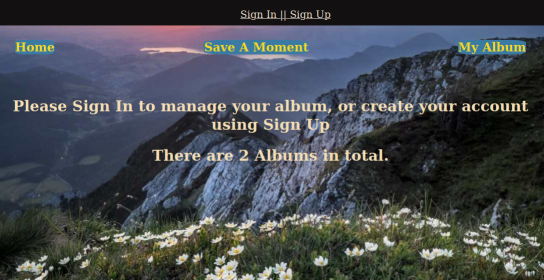

# myAlbum

<h2>Introduction</h2>
  A simple Django App designed to save photos, make picture collections or catch a beautiful moment.

<h3>what you can do</h3>

- In Home page, user can see how many records in total in the app.  - In myalbum site:  user can simply create a post and upload image files, delete and browse individual posts.   - In save a moment site: user can catch a 5s video (just a moment) and save it locally.

<h2>Deployment process</h2>
This app is deployed on heroku http://myalbum-djangoapp.herokuapp.com/. 
Here is just a short summary about the deployment experience I would like to share:
<ol>
<li> set App ready to deploy:
   <ul>
   <li> modify SECRET_KEY, and change DEBUG to False in setting.py</li>
   <li> add STATIC_ROOT in setting.py, run static collection.</li>
   <li>  install gunicorn, sqlurl, whitenose etc. </li>
   <li>  create requirement.txt, runtime.txt, Procfile in root</li></ul>
</li>
<li> build on heroku:
   <ul>
  <li>install heroku cli, under project directory, run git init and heroku create (if you want give your app a certain name then maybe run heroku apps:create example (refer to: https://devcenter.heroku.com/articles/creating-apps))</li>
   <li>set heroku config:set DISABLE_COLLECTSTATIC=1, set allowedhost =['*'] actually these can be done after first build on heroku, but during my first building process, there were couple of issues related to static collect, so I did it before and also ran static collection locally at earlier stage 1.2. (refer to https://devcenter.heroku.com/articles/django-assets)</li>
   also when I opened my app at my first trial with allowedhost = ['my domain name'], I got 400 bad request. So  I set allowedhost =['*'].</li>
   
   <li>run git add . and git commit -m "ready to deploy" save app to your local repo. Then run git push main heroku.</li> 
    
   
  <li>After successfully building, run heroku run python3 manage.py migrate, heroku run python3 manage.py createsuperuser</li>
      </ul>
</li>

<ol>

<h2>Any idea, suggestion would be most welcomed and appreciated</h2>
